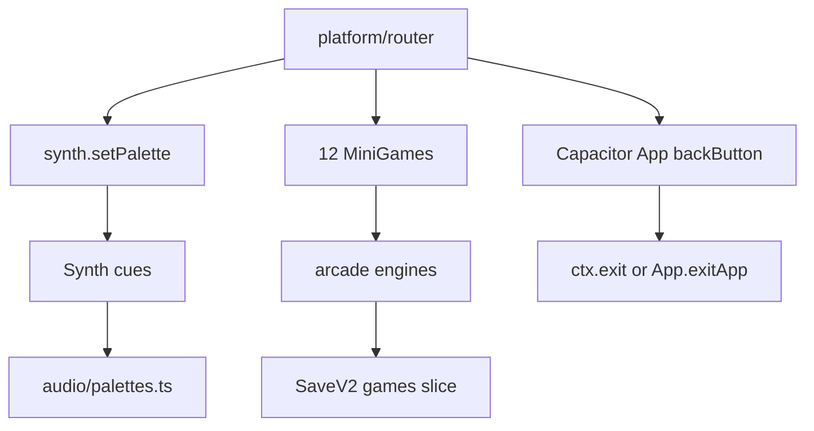

# Arcade Audio Palettes, Thin-Game Upgrades, and Play Store AAB

Date: 2026-09-17
Status: approved-pending-review
Branch: `260916-feat-arcade-audit-fixes`

## Goal

Ship three production layers in one pass:

1. Per-game Web Audio SFX palettes (no BGM files, no new audio libraries).
2. Content upgrades for the six thin arcade games only.
3. A signed, minify-on Play Store App Bundle (`npm run android:aab`).

Puzzle packs already in Glowtrail (120), Prism (105), Glyph (105), Fusion, Blocks, and Arrows stay as they are. No new games. `src/arcade` dead files stay until a later explicit delete.

## Architecture

Keep the existing `Synth` singleton in `src/audio/synth.ts`. Add `src/audio/palettes.ts` with one `AudioPalette` per `GameId` plus `hub`. The router sets the palette on mount and resets it to `hub` on home. Cue method names do not change; they read the active palette at play time.

Arcade upgrades live in each game's engine (and HUD copy). New stage or goal numbers are derived at runtime from score or authored tables. Save slices stay `{ best, level? }` so existing v2 saves keep loading.

Android stays Capacitor 6 wrapping `dist/`. Version bumps to `1.1.0` / `versionCode 2`. Release minify turns on. The existing `.android-signing/` keystore signs `bundleRelease`.



## Audio palettes

### Palette shape

```ts
interface AudioPalette {
  id: string;
  baseHz: number;
  wave: OscillatorType;
  gain: number;
  stinger: number[];
}
```

- `baseHz` scales tap/step/combo pitches relative to today's defaults.
- `wave` is the oscillator type for that game's identity (square cyber, sine puzzle, triangle word, saw arcade).
- `gain` is a per-palette multiplier on top of the master gain.
- `stinger` is an interval list in Hz used by `success` / `star` / `gameover` so win/fail chords differ per game.

Every `GameId` and `hub` has a kit. Unknown id falls back to `hub`. Mute still short-circuits before any oscillator is created.

### Synth changes

- Add a master `GainNode` so `setVolume` actually scales output. Default volume is 1. Mute sets gain to 0 and skips cue construction.
- `setPalette(id: GameId | "hub")` stores the active kit. Cue methods (`tap`, `step`, `combo`, `success`, `star`, `fail`, `gameover`, `launch`, `bounce`, `laser`, `powerup`, `explosion`, `blocked`, `reveal`, `sweep`) multiply frequency and gain from that kit.
- Gesture unlock in `src/main.ts` stays: first pointerdown/keydown calls `synth.unlock()`.

### Wiring

- `startRouter` calls `synth.setPalette(desc.meta.id)` inside `mountGame` after the module loads, and `synth.setPalette("hub")` inside `showHome`.
- Platform `createAudio()` keeps today's cue names and still forwards to `synth`. Arcade controllers that call `synth.*` directly keep doing so; they pick up the palette automatically.
- No audio files. No looping BGM. APK size stays in the current ballpark.

### Identity map (timbres, not copy)

| Palette | baseHz | wave | Use |
| --- | --- | --- | --- |
| hub | 440 | sine | launcher taps |
| glowtrail | 520 | sine | path rotate / launch |
| fusion | 480 | triangle | drop / merge |
| prism | 500 | sine | pour |
| glyph | 460 | triangle | letter commit |
| blocks | 420 | square | place / line |
| arrows | 540 | square | launch / blocked |
| snake | 560 | sawtooth | chomp / combo |
| breaker | 330 | square | bounce / laser |
| matrix | 392 | triangle | slide / merge |
| wordsearch | 600 | sine | ray / found |
| wordconnect | 494 | triangle | wheel / word |
| meowdoku | 370 | sine | place / invalid |

## Arcade content upgrades

Only these six games change. Each keeps its current core loop, board, and win/fail rule. Skills already in a game stay; this pass adds progression around them, not a second verb.

### CYBER SNAKE

Add `stage` derived from score thresholds (0 / 500 / 1500 / 4000 / 8000). Each stage shortens `baseIntervalMs` and, from stage 3, shrinks the playable board by 2 cells on each axis (clamped so the snake still fits). HUD shows `STAGE n`. Phase / slowmo / multiplier orbs stay. No new persist field.

### NEON BREAKER

Replace the purely procedural early waves with an authored `STAGES` table of at least 12 named layouts. Each stage declares brick pattern, special cadence (laser / splitter / bomb), and ball count. After the table ends, the existing procedural generator continues with `wave` as seed. Skills already in the engine (laser, splitter, bomb, recall, speed) stay; the table is what players progress through. HUD already shows `STAGE`; it should name the authored stage while inside the table.

### CYBER 2048

Keep the 4x4 slide. After the first 2048, the victory card offers Keep Playing toward a 4096 overdrive goal. `daily(seed)` already exists on the MiniGame; wire a seeded first-tile sequence when the daily route mounts this game. Undo stays one step. No new persist field beyond `best`.

### NEON WORD SEARCH

Add at least 4 new categories and a fourth difficulty (`expert`: 14x14, longer word floor). Existing easy/hard/master configs stay. Score still resets on difficulty change. Report still fires once on a cleared board.

### NEON WORD CONNECT

`WORD_CONNECT_LEVELS` currently has 52 entries and wraps. Extend the authored pack to at least 80 unique levels so late play does not repeat the opening set. Bonus-word slots stay. Level persist stays `save.level`.

### MEOWDOKU

Keep queens rules (one cat per row/column/region, no adjacency). Add extra region templates so levels 1-30 are not the same region cut on a growing grid. Hearts stay 3, hints stay 2. `beginLevel` keeps a retry-stable seed. Report still fires on win only.

## Android Play Store AAB

### Identity and version

- `applicationId` / `namespace`: `com.glowtrail.app` (unchanged).
- `versionName`: `1.1.0` in both `package.json` and `android/app/build.gradle`.
- `versionCode`: `2`.

### Native shell

- `MainActivity` stays a `BridgeActivity`.
- Capacitor `App` `backButton` listener already in `src/platform/router.ts`: in-game `backHandler` first, else navigate home, else `App.exitApp()`. Do not duplicate this in Java.
- `AndroidManifest.xml`: add `android.permission.VIBRATE`; set `android:hardwareAccelerated="true"` on `<application>`. Keep portrait and `singleTask`.
- Internet permission stays (Capacitor default). No new network calls.

### Gradle release

- `minifyEnabled true` for the release build type, with Capacitor keep rules so the JS bridge is not stripped.
- Existing signing block reads `../.android-signing/keystore.properties`. If that file is missing, the release build is unsigned and must not be uploaded.
- `npm run android:aab` remains: `npm run build && cap sync android && ./android/gradlew -p android bundleRelease`.
- `npm run android:apk` stays as the sideload extra.

### WebView / audio on Android

- First user gesture still unlocks `AudioContext` (`src/main.ts`).
- Do not register the service worker inside the native shell (already gated by `isNativeShell()`).

## Data flow and saves

- Palette is session state on `Synth`, never written to `SaveV2`.
- Snake stage, breaker authored-stage index, and 2048 overdrive goal are derived, not persisted.
- Word Connect and Meowdoku keep persisting `level`. Word Search keeps persisting `best` and `level` as today.
- XP `ctx.report` stays terminal-only (win / loss / cleared board), as fixed on this branch.

## Error handling

- Missing `AudioContext` or suspended context: cues no-op.
- Unknown palette id: hub palette.
- Capacitor App plugin unavailable: back-button listener is skipped (`.catch(() => undefined)` already).
- Missing keystore: Gradle builds an unsigned bundle; do not treat that as a store artifact.
- Minify must not break `BridgeActivity` or `@capacitor/app`. If a release WebView fails to boot, the keep-rules are the first fix, not turning minify back off without evidence.

## Testing

- `tests/audio.test.ts`: every `GameId` plus hub has a palette; unknown id falls back; mute still silences; `setVolume` changes master gain without throwing.
- Snake: stage thresholds change interval and, at stage 3+, board size.
- Breaker: first 12 waves come from the authored table; wave 13+ is procedural and deterministic for a given wave index.
- Word Connect: pack length is at least 80 and levels are unique by letter set + target words.
- Word Search: expert difficulty is 14x14; new categories exist; difficulty change still zeros score.
- Meowdoku: extra templates produce valid queens boards; existing 13 tests still pass.
- Full suite stays green (`npx tsc --noEmit`, `npx vitest run`, `npm run build`).
- Android: if SDK and keystore are present, `npm run android:aab` produces `android/app/build/outputs/bundle/release/app-release.aab`. If either is missing, document the skip; do not fake a signed artifact.
- Playwright: 12 games x 3 viewports, 0 console errors, canvas aspect intact.

## Out of scope

- Looping BGM or bundled audio files.
- New games, or expanding Glowtrail / Prism / Glyph / Fusion / Blocks / Arrows packs.
- Deleting `src/arcade`.
- Changing `applicationId`.
- Play Console listing copy, screenshots, or content rating.
- iOS.

## Success criteria

The web app still runs at `http://localhost:5173/` with palettes audible per game (and silent when muted). The six arcade games show the new progression. `tsc` / vitest / production build pass. A signed AAB exists at the Gradle output path when signing files are present.
